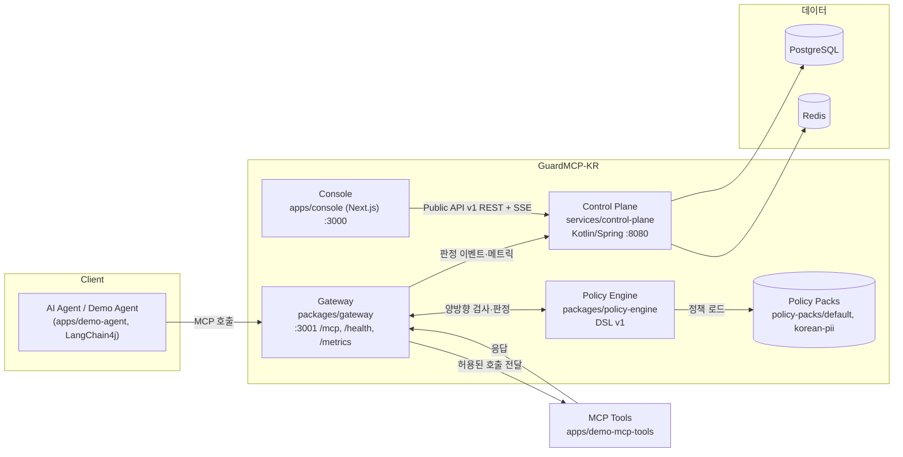

# GuardMCP-KR 중간 결과보고서 (1차)

2026 OSS 공모전 · 작성일 2026-07-31 · 작성: GuardMCP-KR 팀 (GMCP-32) · 최종본은 [GMCP-47](https://github.com/2026-OSS-Contest/GuradMCP-KR)에서 이 문서를 골격으로 확정합니다.

## 1. 개요

GuardMCP-KR은 AI Agent와 MCP(Model Context Protocol) 서버 사이에 위치하는 한국어 개인정보 보호형 오픈소스 보안 게이트웨이입니다. 모든 tool 호출의 요청과 응답을 양방향으로 검사해 YAML 정책, 한국형 PII·Secret·프롬프트 인젝션 탐지 결과, 위험 점수를 종합한 뒤 `allow` / `warn` / `mask_then_allow` / `require_approval` / `block` 중 하나를 판정합니다.

2026-07-18 프로젝트 부트스트랩 이후 이 보고서 작성 시점(2026-07-31)까지 `dev` 브랜치에는 94개 커밋, 21건의 병합 PR이 반영되어 있습니다. 이번 1차 보고서는 개발계획서 3장(문제 정의), 5장(솔루션), 8장(아키텍처) 구성을 따르고, 여기에 중간 벤치마크 실측치와 남은 계획을 더합니다.

## 2. 문제 정의 (3장)

- **검사 지점의 부재.** MCP는 AI Agent가 외부 tool 서버를 호출하는 표준 프로토콜이지만, 프로토콜 자체에는 요청·응답 내용을 검사하는 보안 계층이 없습니다. Agent가 신뢰할 수 없는 MCP 서버에 연결되면 tool 인자나 응답에 포함된 개인정보·자격증명·악성 지시문이 검사 없이 그대로 오갑니다.
- **한국형 개인정보 위험.** 휴대전화번호, 주민등록번호 유사 패턴, 사업자등록번호, 계좌번호 등 한국 특화 PII 형식은 범용 DLP 도구의 기본 규칙에 잘 포착되지 않습니다.
- **간접 프롬프트 인젝션.** MCP 서버 응답(tool 설명, 문서 요약 등)에 삽입된 지시문이 Agent의 다음 행동을 오염시킬 수 있습니다. 같은 페이로드라도 Agent가 곧 신뢰하게 되는 응답 방향과, 사용자가 직접 작성한 요청 방향은 위험도가 다릅니다.
- **설명 불가능한 차단.** 보안 도구가 있어도 왜 차단됐는지 알 수 없으면 운영자가 정책을 신뢰하거나 튜닝하기 어렵습니다.

이 네 가지를 목표로 삼아, GuardMCP-KR은 (1) 프로토콜 레벨 게이트웨이, (2) 코드 없이 확장 가능한 정책 DSL, (3) 한국형 탐지기, (4) 설명 가능한 판정을 제공하는 것을 목표로 합니다.

## 3. 솔루션 (5장)

| 기능 | 구현 위치 | 현재 상태 |
| --- | --- | --- |
| Gateway tool-call 인터셉션 | `packages/gateway` (MCP 프록시, `/mcp` 엔드포인트) | 완료 — 요청/응답 양방향 검사, 계측(instrumentation)과 `/metrics` 노출까지 반영 |
| 정책 엔진 (DSL v1) | `packages/policy-engine` | 완료 — `direction`/`tool`/`server_trust`/`args`/`detections`/`risk_score` 6개 match 축, 5개 action, `severity-max`/`first-match` 평가 전략 |
| 한국형 PII·Secret 탐지기 | `packages/gateway/src/rules/{pii,secret,bank-accounts}.json` | 완료 — 휴대전화·RRN 유사 패턴·사업자등록번호·계좌번호·카드번호·주소·여권·운전면허 9개 유형, 체크섬/Luhn 등 형식 검증 포함 |
| 프롬프트 인젝션 탐지·정책 | `packages/gateway/src/rules/injection.json`, `policy-packs/default` | 완료(기본) + 진행 중 — 응답 방향은 차단, 요청 방향은 경고로 강도를 분리하는 비대칭 정책을 반영. base64 등 난독화 전처리(GMCP-8)는 리뷰 중인 오픈 PR |
| 위험 점수 산식 | `packages/gateway/src/risk.ts` | 완료 — 탐지 유형·신뢰도·다양성·tool 위험도·서버 신뢰·대량 가중을 합산한 0–100 점수, `docs/risk-scoring.md`에 산식과 계산 예시 공개 |
| 승인 워크플로 (Approval) | `packages/gateway/src/approval/backend.ts` (연동 지점) + `services/control-plane` | 진행 중 — DSL에 `require_approval` action과 timeout/fail-closed 규칙은 확정되어 있고, Gateway 쪽에는 `ApprovalBackend` 인터페이스와 참조용 인메모리 구현이 있습니다. Control Plane 승인 콘솔(GMCP-82)은 `feature/GMCP-82-approval-workflow` 브랜치에서 fail-closed 승인 백엔드가 구현되었으나 아직 `dev`에 병합되지 않았습니다. 현재 `dev` 기준 데모는 `require_approval` 판정 시 upstream을 실행하지 않고 오류로 거부합니다. |
| Console | `apps/console` (Next.js) | 진행 중 — `approvals`/`demo`/`detector`/`policies`/`replay`/`settings` 라우트 구조와 SSE 이벤트 스트림 훅(GMCP-86)이 반영됐고 Playwright e2e가 홈·replay 화면에서 시작됐습니다. 다수 화면은 `screen-stub` 컴포넌트 기반의 초기 단계입니다. |
| Control Plane 공개 API v1 | `services/control-plane` (Kotlin/Spring) | 완료(v1 범위) — `docs/api/control-plane-openapi.yaml`에 overview/sessions/policies/approvals/detect/attack-lab 6개 태그로 명세, 고정 시드(`infra/postgres`, `infra/redis`) 기반 |

## 4. 아키텍처 (8장)

- **Gateway**(TypeScript/Node)가 MCP 프록시로서 모든 요청·응답을 가로채 Policy Engine에 넘기고, 판정 근거(정책 ID, 탐지 항목, 위험 점수)를 MCP 응답 metadata로 반환합니다.
- **Policy Engine**은 `policy-packs/**`의 YAML을 `npm run policy:generate`로 `packages/gateway/src/policies.generated.ts`에 결정론적으로 컴파일해 Gateway가 로드합니다.
- **Control Plane**(Kotlin/Spring)은 콘솔이 쓰는 공개 API v1을 서빙하고 PostgreSQL·Redis로 기동/헬스/고정 시드 경계를 검증합니다. 판정 이력의 영구 저장은 아직 구현되지 않았습니다.
- **Console**(Next.js)은 Control Plane API와 SSE로 통신하며, `docker compose --profile demo`에서 Demo Agent·Demo MCP Tools와 함께 고정 시드 데모를 구성합니다.

## 5. 중간 벤치마크 수치

`npm run bench` (`attack-lab/benchmark/run.ts`)의 2026-07-31T11:55:34Z 로컬 실행 결과입니다(`docs/benchmark-gate.md`의 재현 절차와 동일 명령). 8개 배포 정책, 63개 샘플(양성 37 / 음성 26)에 대한 측정치입니다.

| 지표 | 실측값 | 합격 기준 | 판정 |
| --- | --- | --- | --- |
| 한국형 PII Recall | 100% (1.0) | ≥ 90% | 통과 |
| 정상 샘플 FPR | 0% (0.0) | ≤ 5% | 통과 |
| Precision | 100% (1.0) | report-only | — |
| 공격 차단율 (blockRate) | 100% (1.0) | ≥ 80% | 통과 |
| 시나리오 기대값 일치율 | 100% (29/29) | = 100% | 통과 |
| 기여 fixture 일치율 | 100% (16/16) | = 100% | 통과 |
| 정책 fixture 커버리지 | 100% (8/8 정책) | = 100% | 통과 |
| Rule pipeline p95 (10,240 byte payload) | 0.192 ms | ≤ 50 ms | 통과 |
| Rule pipeline 평균 지연 | 0.161 ms | report-only | — |

- **유형별 Recall**: ADDRESS, BANK_ACCOUNT, BIZ_NO, CARD, DL_NO, EMAIL, PASSPORT, PHONE, RRN_LIKE 9개 라벨 유형 모두 100% recall (예: PHONE 7/7, CARD 5/5, ADDRESS 7/7).
- **형식 검증 효과(`validationImpact`)**: 주민등록번호 체크섬·사업자등록번호 검증식·카드 Luhn·계좌 자릿수 검증을 껐을 때 FPR은 15.4%(4/26)였으나, 형식 검증을 켠 현재 배포 구성에서는 FPR이 0%로 떨어집니다 — 형식 검증만으로 음성 샘플 오탐 4건을 제거한 것이 실측으로 확인됩니다.
- **시나리오 커버리지**: 위험 tool 접근·PII 대량 유출·오염된 tool 설명·난독화 인젝션 등 공격 시나리오(T-01~T-15, 일부 하위 케이스 포함) 17건과 정상 업무 시나리오(B-01~B-12) 12건, 총 29건 전량 기대값과 일치했습니다.

## 6. 진행 현황

### 완료 (`dev` 병합 완료, 21건 PR)

- 정책 DSL v1과 평가 엔진, `default`/`korean-pii`/`author-test`/`author-retest` 정책팩
- 한국형 PII·Secret 탐지기 및 형식 검증 로직 (GMCP-22 등)
- 위험 점수 산식과 방향별(request/response) 인젝션 정책 비대칭 처리 (GMCP-74)
- Gateway 인터셉터 계측·메트릭 노출 (GMCP-52)
- 취약/가드 비교 데모 경로, Demo Agent의 실제 tool 서버 연동 (GMCP-40, GMCP-42)
- Control Plane 공개 API v1과 OpenAPI 명세 (GMCP-79)
- Console SSE 이벤트 스트림 재연결 훅 (GMCP-86)
- 정책팩 벤치마크 게이트(`npm run bench`)와 CI 품질 게이트

### 진행 중 (오픈 PR / 미병합 브랜치)

- PR #52 (GMCP-66) tool 설명 오염(description poisoning) 격리 — 리뷰 중
- PR #53 (GMCP-53) 판정 근거 설명 생성기(explanation generator) — 리뷰 중
- PR #54 (GMCP-8) 인젝션 규칙 전 base64 등 난독화 디코딩 전처리 — 리뷰 중
- GMCP-82 승인 워크플로: Control Plane 쪽 fail-closed 승인 백엔드 구현이 `feature/GMCP-82-approval-workflow` 브랜치에 존재하나 `dev`에는 아직 병합되지 않음. Gateway 쪽 `ApprovalBackend` 연동 지점은 `dev`에 이미 반영됨.
- Console 화면 실데이터 연동 (다수 화면이 `screen-stub` 기반 초기 단계)

### 예정

- Control Plane 승인 워크플로 병합과 Console Approval Card 연동
- 판정 이력 영구 저장 및 Replay 기능(현재 README에 명시된 한계)
- E2E 테스트 확충 (`apps/console/e2e`는 현재 home/replay 2개 spec)
- 벤치마크 데이터셋 확충 — 오픈 good-first-issue 5건(사업자등록번호 fixture, 휴대전화 오탐 회귀, zero-width 인젝션 T-07 샘플, korean-pii 정책 해설 등) 처리

## 7. 남은 계획

| 시기 | 계획 |
| --- | --- |
| W5 이후 (8월 초~중순) | 승인 워크플로 Control Plane 병합, Console Approval Card 및 Replay 실데이터 연동, E2E 테스트(Playwright) 확충 |
| ~2026-08-20 | **기능 동결(feature freeze)** — 신규 기능 병합 중단, 안정화·버그 수정만 진행 |
| 동결 후 | 벤치마크 데이터셋·정책 fixture 확충으로 회귀 커버리지 강화, 문서(한/영) 동기화 점검 |
| 2026-08-27 | **최종 제출** — 이 문서를 골격으로 GMCP-47 최종 결과보고서 확정 |

## 부록: 참고 문서

- [README](../../README.md), [Quick Start](../quickstart.md)
- [정책 작성 가이드](../policy-guide/README.md), [위험 점수 산식](../risk-scoring.md), [벤치마크 게이트](../benchmark-gate.md)
- [Control Plane OpenAPI](../api/control-plane-openapi.yaml)
